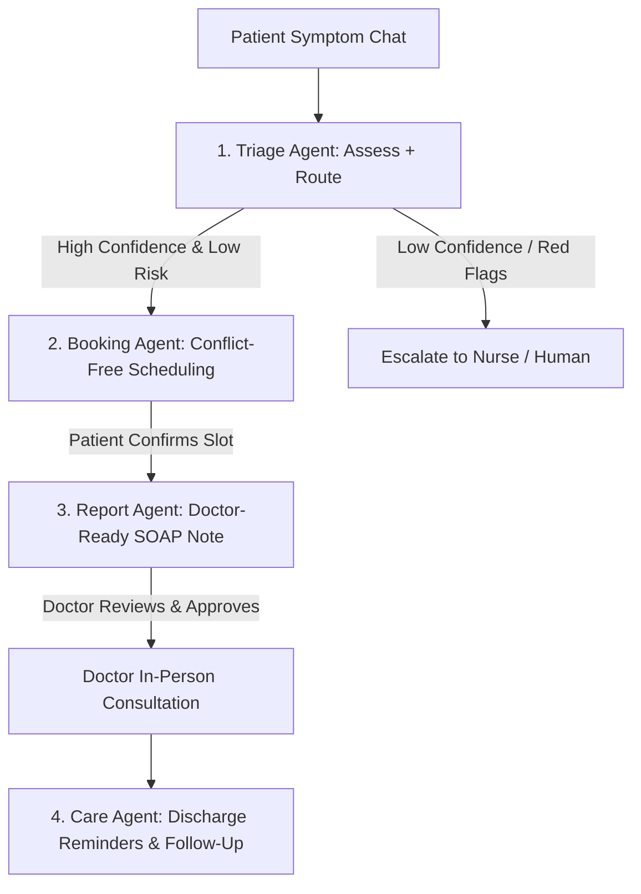

# Health-Care-Assistant: Multi-Agent Healthcare Coordination System

An enterprise-ready **AI Agent-Based Hospital Appointment and Patient Guidance System** built with FastAPI, Scikit-learn TF-IDF RAG, pluggable LLM provider engine (Ollama / Anthropic / OpenAI / Gemini / Template), 4-Agent clinical coordination pipeline, emergency red-flag safety triage, multi-turn clinical context memory, mobile REST API router, and a React + Vite support console.

> **Core Philosophy**: *Safe by design: every AI agent recommends, a qualified human decides.*

---

## 🏛 The 4-Agent Architecture



### 1. 🩺 Agent 1: Triage Agent (Assess + Route)
- **4-Step Protocol**: Symptom Intake $\rightarrow$ Structured Extraction $\rightarrow$ Ranked Possibility List $\rightarrow$ Confidence Gating.
- Maps symptoms to medical departments (*Cardiology, Endocrinology, Pulmonology, Gastroenterology, General Medicine*).
- **Safety Gate**: Defers to human / nurse escalation whenever confidence is low or red-flag emergency symptoms appear.

### 2. 📅 Agent 2: Booking Agent (Conflict-Free Scheduling)
- Checks live doctor schedules and department availability.
- Enforces database-level concurrency control so no two patients can claim the same slot.
- **Safety Gate**: Requires explicit patient confirmation before any provisional hold becomes final.

### 3. 📝 Agent 3: Report Agent (Doctor-Ready Draft Summaries)
- Converts chat transcripts and clinical context memory into structured **SOAP notes** (*Subjective, Objective, Assessment, Plan*).
- Suggests tailored preliminary diagnostic lab tests.
- **Safety Gate**: Handed to the doctor as an editable draft—nothing enters official medical records unapproved.

### 4. 💊 Agent 4: Care Agent (Discharge-Time Reminders & Follow-Up)
- Ingests approved prescriptions and schedules medication pill alerts and follow-up appointment reminders.
- **Safety Gate**: Patients retain full control to adjust timing, pause, or opt out of individual reminders at any time.

---

## 🌟 Key Features

- **Multi-Agent REST APIs**: Dedicated endpoints under `/api/agents/` for triage assessment, live slot locking, SOAP report generation, and post-discharge care.
- **Mobile-Ready Architecture**: High-speed mobile endpoints (`/mobile/api/chat`, `/mobile/api/triage`, `/mobile/api/config`) compatible with iOS, Android Emulator (`10.0.2.2`), and React Native / Capacitor apps.
- **Zero-GPU Clinical RAG Engine**: Instant document grounding using TF-IDF + Cosine Similarity over medical guidelines (`.md`, `.txt`, `.pdf`).
- **Pluggable LLM Layer**: Zero-code switching between `template` (offline fallback), `ollama` (local Llama 3.2), `anthropic` (Claude 3.5), `openai` (GPT-4o-mini), and `gemini` (Gemini Flash).
- **Multi-Turn Context Memory**: Automatic parsing of patient age brackets, sex, symptoms, duration ranges, current medications, and lab results without looping.

---

## 📱 Mobile Integration (CarePulse / React Native / Capacitor)

See **[MOBILE_INTEGRATION.md](file:///c:/Users/Monish%20JB/OneDrive/Desktop/RAG_ChatBot/MOBILE_INTEGRATION.md)** and use the JavaScript SDK client at [`frontend/src/api/mobileClient.js`](file:///c:/Users/Monish%20JB/OneDrive/Desktop/RAG_ChatBot/frontend/src/api/mobileClient.js):

```javascript
import { MobileHealthCopilot } from './mobileClient';

const copilot = new MobileHealthCopilot({ baseUrl: 'http://10.0.2.2:8000' });
copilot.setAuthToken(userToken);

// 1. Rapid Standalone Triage Evaluation
const triage = await copilot.checkTriage("Sudden chest tightness and dizziness");

// 2. Chat with 4-Agent Coordination
const response = await copilot.sendChatMessage("I have had fatigue and weight gain for 3 weeks.");
```

---

## 🛠 Tech Stack

- **Backend**: Python 3.12, FastAPI, SQLAlchemy, SQLite (swappable to PostgreSQL via `DATABASE_URL`), PyJWT, bcrypt, Scikit-learn, PyPDF, Uvicorn.
- **Frontend**: React 18, Vite, React Router v6, Recharts, Lucide React, Axios.
- **Containerization**: Docker, Docker Compose.

---

## 🚀 Quick Start

### 1. Backend Setup

```bash
cd backend
python -m venv venv
# On Windows:
venv\Scripts\activate
# On macOS/Linux:
source venv/bin/activate

pip install -r requirements.txt
python -m uvicorn app.main:app --port 8000 --reload
```

### 2. Frontend Setup

```bash
cd frontend
npm install
npm run dev
```

Open your browser at **`http://localhost:5173`**.

---

## 🧪 Automated Verification Suites

```bash
# Complete 4-Agent E2E Pipeline (Triage, Booking, SOAP, Care Reminders)
python backend/test_4_agents_e2e.py

# Mobile API Integration Suite
python backend/test_mobile_api.py

# Multi-Agent Medical Reasoning & Triage Suite
python backend/test_e2e_medical.py
```
